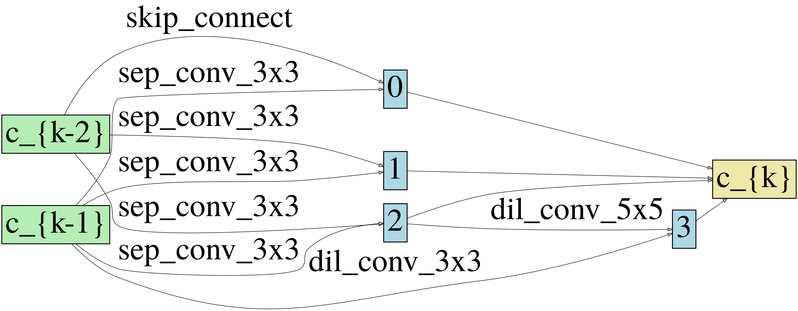
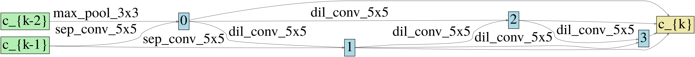
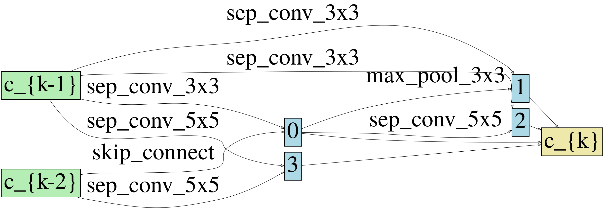
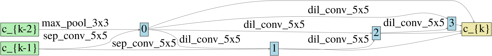

## DropNAS: Grouped Operation Dropout for Differentiable Architecture Search

DropNAS, a grouped operation dropout method for one-level DARTS, with better and more stable performance.

### Requirements

- python-3.5.2
- pytorch-1.0.0
- torchvision-0.2.0
- tensorboardX-2.0
- graphviz-0.14

### How to use the code

- Search

```shell script

# with the default setting presented in paper, but you may need to adjust the batch size to prevent OOM 
python3 search.py --name cifar10_example --dataset CIFAR10 --gpus 0

```

- Augment

```shell script

# use the genotype we found on CIFAR10

python3 augment.py --name cifar10_example --dataset CIFAR10 --gpus 0 --genotype "Genotype(
    normal=[[('sep_conv_3x3', 1), ('skip_connect', 0)], [('sep_conv_3x3', 1), ('sep_conv_3x3', 0)], [('sep_conv_3x3', 1), ('sep_conv_3x3', 0)], [('dil_conv_5x5', 4), ('dil_conv_3x3', 1)]],
    normal_concat=range(2, 6),
    reduce=[[('max_pool_3x3', 0), ('sep_conv_5x5', 1)], [('dil_conv_5x5', 2), ('sep_conv_5x5', 1)], [('dil_conv_5x5', 3), ('dil_conv_5x5', 2)], [('dil_conv_5x5', 3), ('dil_conv_5x5', 4)]],
    reduce_concat=range(2, 6)
)"
```

### Results

The following results in CIFAR-10/100 are obtained with the default setting. More results with different arguements and other dataset like ImageNet can be found in the paper.

|Dataset|Avg Acc (%)|Best Acc (%)|
|---|---|---|
|CIFAR-10|97.42±0.14|97.74|
|CIFAR-100|83.05±0.41|83.61|

The performance of DropNAS and one-level DARTS across different search spaces on CIFAR-10/100.

|Dataset|Search Space|DropNAS Acc (%)|one-level DARTS Acc (%)|
|---|---|---|---|
|CIFAR-10|3-skip|97.32±0.10|96.81±0.18|
| |1-skip|97.33±0.11|97.15±0.12|
| |original|97.42±0.14|97.10±0.16|
|CIFAR-100|3-skip|83.03±0.35|82.00±0.34|
| |1-skip|83.53±0.19|82.27±0.25|
| |original|83.05±0.41|82.73±0.36|

The test error of DropNAS on CIFAR-10 when different operation groups are applied with different drop path rates.

| | r_p=1e-5| r_p=3e-5 | r_p=1e-4 |
|---|---|---|---|
| **r_np=1e-5** |97.40±0.16|97.28±0.04|97.36±0.12|
| **r_np=3e-5** |97.36±0.11|97.42±0.14|97.31±0.05|
| **r_np=1e-4** |97.35±0.07|97.31±0.10|97.37±0.16|


### Found Architectures

<p align="center">


<br/> CIFAR-10 
</p>

<p align="center">


<br/> CIFAR100 
</p>

### Reference

[1] https://github.com/quark0/darts (official implementation of DARTS)

[2] https://github.com/khanrc/pt.darts

[3] https://github.com/susan0199/StacNAS (feature map code used in our paper)
